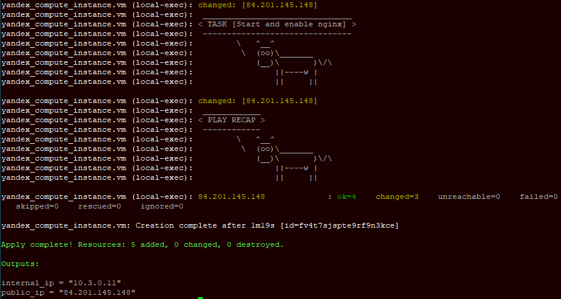
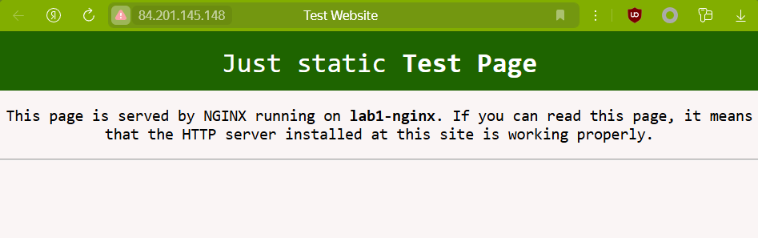

В данной лабе развертывается одна ВМ с настроенным NGINX.
# Задача
Развернуть с помощью terraform одну виртуалку;
Запровиженить nginx с помощью Ansible.

# Реализация 
## Подготовка terraform и yc (Yandex cloud) 
Устанавливаем terraform с зеркала https://hashicorp-releases.yandexcloud.net/terraform/, устанавливаем YC CLI

```curl -sSL https://storage.yandexcloud.net/yandexcloud-yc/install.sh | bash```

Инициализируем yc, создаем сервисный аккаунт, выдаем ему права и создаем профиль на его основе
```shell
yc iam service-account create --name tf
yc resource-manager folder add-access-binding default --role editor --subject serviceAccount:<идентификатор_сервис_аккаунта>
yc iam key create --service-account-id <идентификатор_сервис_аккаунта> --folder-name default --output key.json
yc config profile create sa-terraform
yc config set service-account-key key.json
yc config set cloud-id <идентификатор_облака>
yc config set folder-id <идентификатор_каталога>
```
Настроим зеркало для загрузки необходимых провайдеров Terraform
```
cat << EOF > ~/.terraformrc
provider_installation {
  network_mirror {
    url = "https://terraform-mirror.yandexcloud.net/"
    include = ["registry.terraform.io/*/*"]
  }
  direct {
    exclude = ["registry.terraform.io/*/*"]
  }
}
EOF
```
Дополнительно включим автодополнение вводимых команд terraform.
```
terraform -install-autocomplete
```
## Развертывание и проверка работоспособности
*При необходимости требуется подправить путь до используемого SSH-ключа, прописанный в переменной `ssh_key` в файле `terraform.tfvars`*

Экспортируем переменные окружения с данными YCloud, которые понадобятся Terraform-у для развертывания стенда.
```
export TF_VAR_TOKEN=$(yc iam create-token)
export TF_VAR_CLOUD_ID=$(yc config get cloud-id)
export TF_VAR_FOLDER_ID=$(yc config get folder-id)
```
Проинициализируем проект, выполнив в текущей директории
```
terraform init
```
Далее выполним, согласившись на выполнение действий по развертыванию
```
terraform plan
terraform apply
```


После развертывания, для проверки можно воспользоваться выведенным *public_ip* и проверить, что кастомизированная страничка NGINX отдается по запросу *http://<public_IP>*


