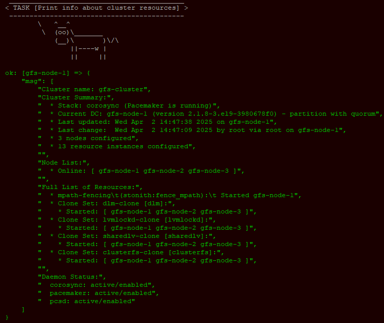
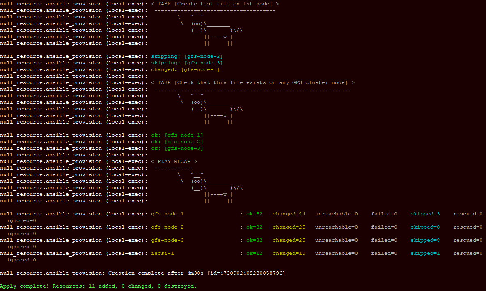

В данном проекте поднимается 3- узловой кластеризованное хранилище с кластерной ФС GFS2. 

# Задача
Поднять 1 ВМ с общим хранилищем, отдающую по iSCSI общий LUN для кластера GFS2, а также 3 ВМ в качестве узлов HA-кластера GFS2.

# Реализация
## Подготовка terraform (Yandex cloud)
*предполагается, что установка провайдеров и настройка утилиты `yc` уже проведена аналогично описанному в [prereq](../lab1/readme.md)*
Экспортируйте переменные окружения с требуемыми данными YCloud для Terraform:
```
export TF_VAR_TOKEN=$(yc iam create-token)
export TF_VAR_CLOUD_ID=$(yc config get cloud-id)
export TF_VAR_FOLDER_ID=$(yc config get folder-id)
```
## Развертывание и проверка работоспособности
*При необходимости требуется подправить путь до используемого SSH-ключа, прописанный в переменной `ssh_key` в файле `terraform.tfvars`*

*Для ролей Ansible iscsi и pcs использовались готовые модули из https://github.com/OndrejHome/ansible.targetcli-modules и https://github.com/OndrejHome/ansible.pcs-modules-2*

Для развертывания стенда находясь внутри текущей директории выполним 
```
terraform apply
```
Состояние кластера после развертывания 


Также можем убедиться, что на разных ВМ *gfs-node..* доступен один и тот же тестовый файл внутри */mnt/gfs2/*, по выводу 2 последних выполненных задач Ansible.

