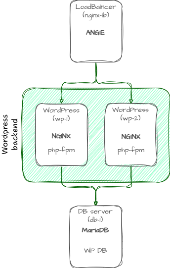
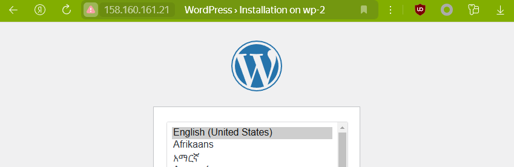
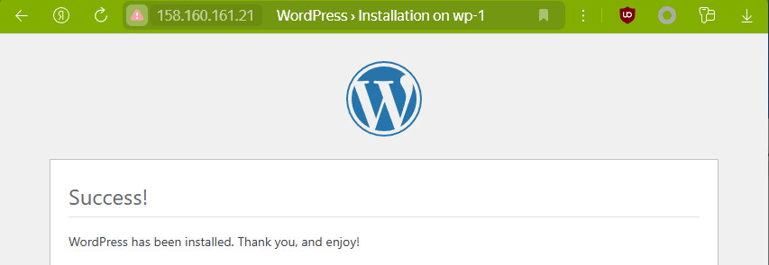
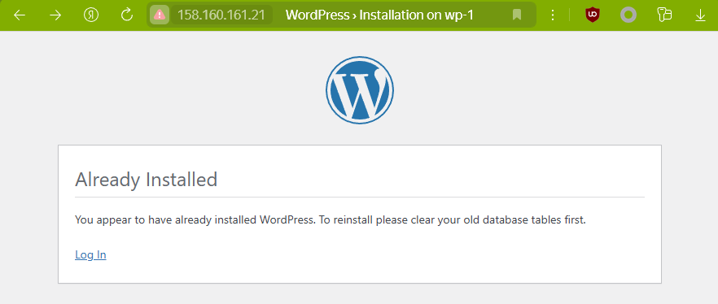
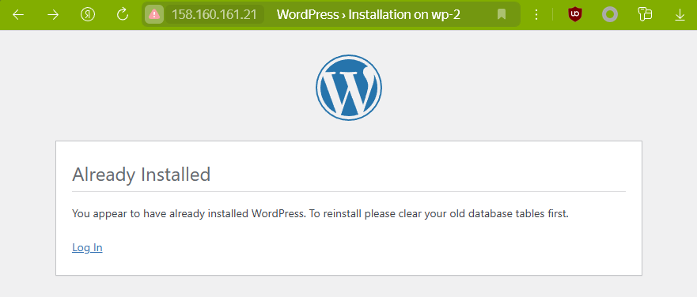

В данном проекте поднимается балансировщик и несколько экземпляров веб-приложения на примере WordPress.
# Задача
Использовать NGINX в качестве балансировщика (reverse-proxy). Поднять 1 ВМ - NGINX - с публичным IP адресом, 2 ВМ - бэкенд на выбор студента (любое приложение из гитхаба - uwsgi/unicorn/php-fpm/java) (WordPress) + NGINX со статикой, 1 ВМ с БД на выбор (mysql/mongodb/postgres/redis) (MуSQL).
# Реализация
## Подготовка terraform (Yandex cloud)
*предполагается, что установка провайдеров и настройка утилиты `yc` уже проведена аналогично описанному в [prereq](../lab1/readme.md)*
Экспортируйте переменные окружения с требуемыми данными YCloud для Terraform:
```
export TF_VAR_TOKEN=$(yc iam create-token)
export TF_VAR_CLOUD_ID=$(yc config get cloud-id)
export TF_VAR_FOLDER_ID=$(yc config get folder-id)
```
## Развертывание и проверка работоспособности
*При необходимости требуется подправить путь до используемого SSH-ключа, прописанный в переменной `ssh_key` в файле `terraform.tfvars`*

Terraform разворачивает следующие ВМ
- 1 виртуальная машина для БД MySQL (`db-1`)
- 1 виртуальная машина для Nginx в качестве балансировщика (`nginx-lb`)
- 2 виртуальные машины для бэкенда Wordpress (`wp-1`, `wp-2`)



Для развертывания стенда находясь внутри текущей директории выполним 
```
terraform apply
```
После развертывания, воспользуемся выведенным в terraform outputs *site_address* для внешнего балансировщика и проверим, что страничка отдается с разных серверов при множественном повторении запросов *http://<public_IP>*.

По умолчанию балансировщик использует `hash` алгоритм, используется значение запрошенного URI. Убедимся, что балансировка работает как ожидается, несколько раз обновим страничку в браузере с приглашением к установке и инициализации WordPress, по заголовку увидим, что она отдается каждый раз с одного и того же сервера. Проведем инициализацию и попадем на страницу, которая будет отдана с другого сервера и при постоянном обновлении будет каждый раз отдаваться с него же.



Далее зайдем на балансировщике `nginx-lb`, в конфигурации (*/etc/angie/sites-available/rp_wordpress.conf*) закомментируем строку `hash` в блоке upstream, чтобы включился базовый алгоритм балансировки `round-robin`. Это можно сделать, выполнив локально  следующую команду (не забудьте подставить вместо `\<IP\>` актуальный адрес `nginx-lb` и при необходимости указать используемый ключ)
```
ssh almauser@<IP> 'sudo sed -i "s/hash/#hash/" /etc/angie/sites-available/rp_wordpress.conf && sudo systemctl restart angie'
```
Проверим, что теперь сайт отдается каждый раз с разного сервера при обновлении страницы в браузере.

