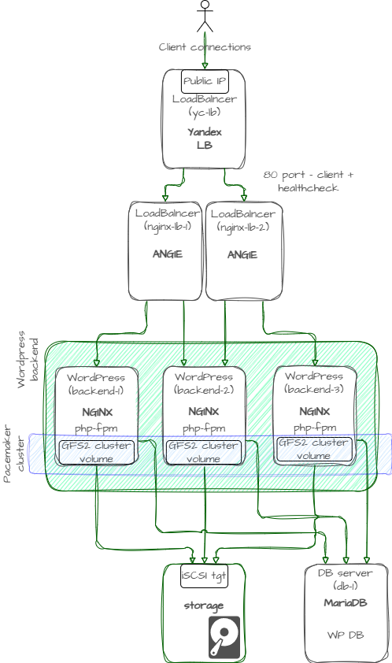
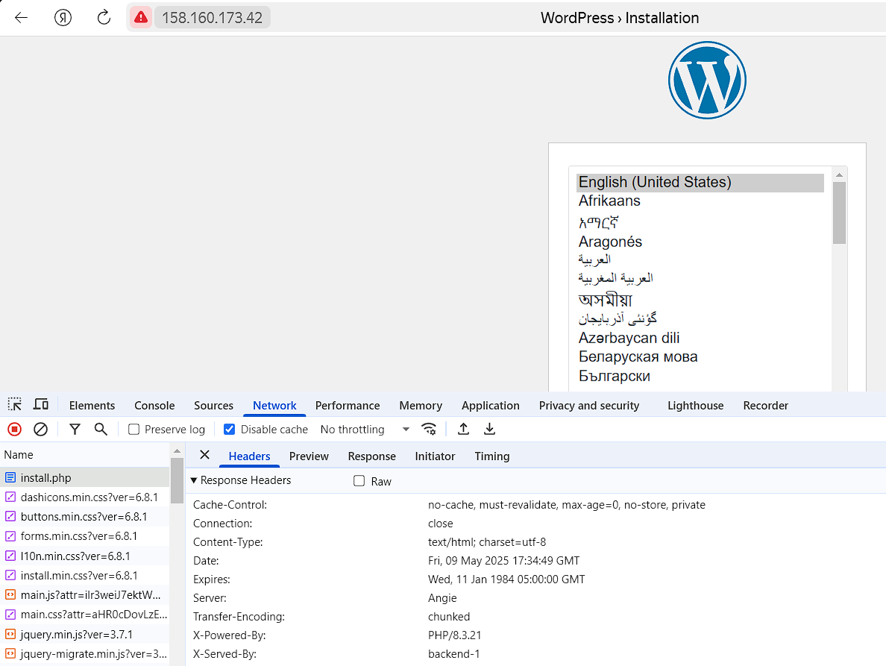
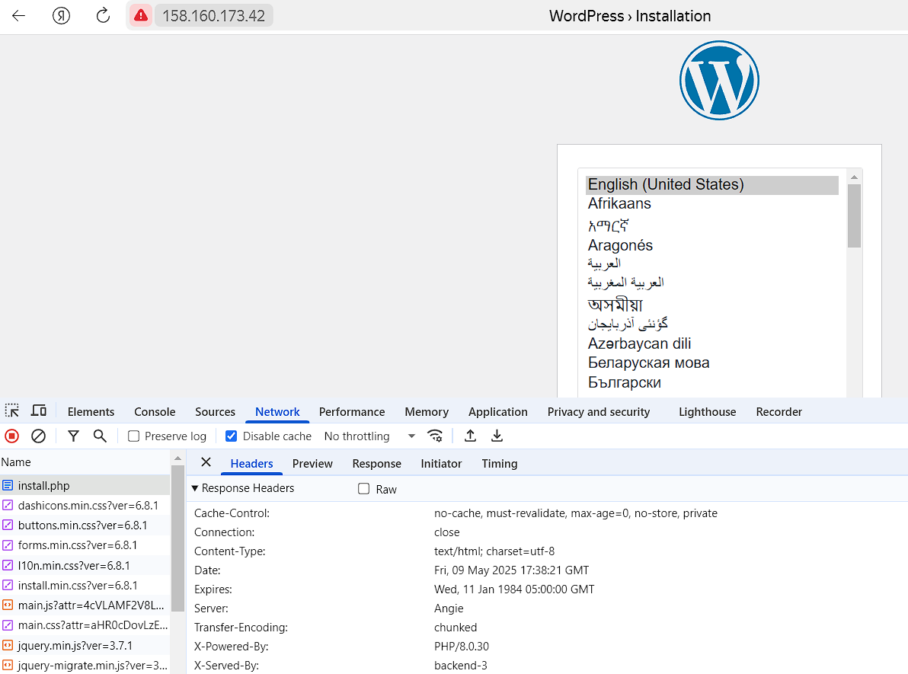
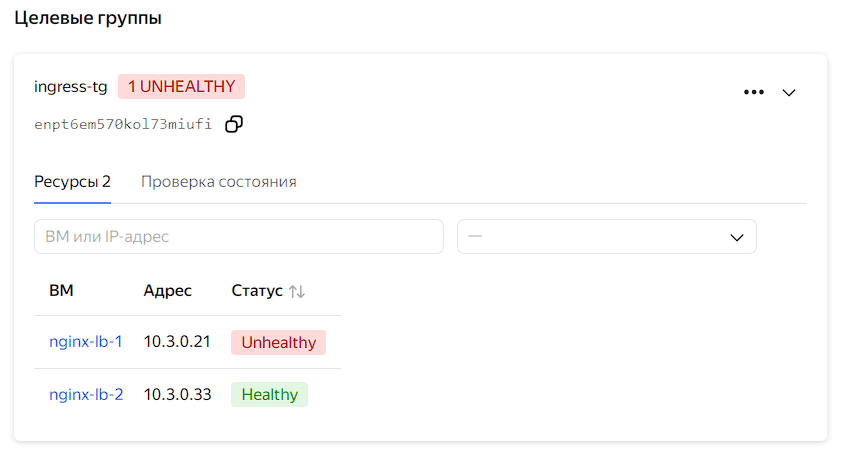

В данном проекте поднимается балансировщик и несколько экземпляров веб-приложения на примере WordPress с общим хранилищем на базе iSCSI и GFS2.
# Задача
Использовать NGINX в качестве балансировщика (reverse-proxy). Поднять 2 ВМ - NGINX reverse proxy, 3 ВМ - бэкенд (WordPress) + NGINX + узел кластера хранилища (PCS/GFS2 + iSCSI initiator), 1 ВМ с БД (MуSQL), 1 ВМ - iSCSI target.
Создать несколько инстансов с помощью терраформ (2 nginx, 2 backend, 1 db).
ИСпользовать балансировщик Яндекс облака для NGINX
Развернуть Nginx при помощи Ansible.
Развернуть бэкенд способный работать по Uwsgi/Unicorn/PHP-FPM и базой данных при помощи Ansible. Можно взять готовую CMS или проект на Django.
Развернуть GFS2 для бэкенд серверах, для хранения статики.
Развернуть СУБД для работы бэкенда при помощи Ansible.
Проверить отказоустойчивость системы при выходе из строя серверов backend или nginx.
# Реализация
## Подготовка terraform (Yandex cloud)
*предполагается, что установка провайдеров и настройка утилиты `yc` уже проведена аналогично описанному в [prereq](../lab1/readme.md)*
Экспортируйте переменные окружения с требуемыми данными YCloud для Terraform:
```
export TF_VAR_TOKEN=$(yc iam create-token)
export TF_VAR_CLOUD_ID=$(yc config get cloud-id)
export TF_VAR_FOLDER_ID=$(yc config get folder-id)
```
## Развертывание и проверка работоспособности
*При необходимости требуется подправить путь до используемого SSH-ключа, прописанный в переменной `ssh_key` в файле `terraform.tfvars`*

Terraform разворачивает следующие ресурсы
- Балансировщик(yc-nlb) с target group из ВМ с ANGIE (reverse proxy)
- 1 ВМ для БД MySQL (`db-1`)
- 2 ВМ с ANGIE в качестве reverse-proxy (`nginx-lb-1`, `nginx-lb-2`)
- 3 ВМ для бэкенда и кластера хранилища на GFS2 (`backend-1`, `backend-2`, `backend-3`)
- 1 виртуальная машина для общего блочного хранилища (iSCSI target) (`storage-1`)



Для развертывания стенда находясь внутри текущей директории выполним 
```
terraform apply
```
После развертывания, воспользуемся выведенным в terraform outputs *site_address* для внешнего балансировщика и проверим, что страничка отдается с разных серверов при множественном повторении запросов *http://<public_IP>*.

По умолчанию NGINX reverse proxy используют `round-robin` алгоритм. В конфигурации NGINX бэкендов прописано добавлять заголовок `X-Served-By`, по которому можно определить, какой бэкенд отдал страничку. Убедимся, что балансировка работает как ожидается, несколько раз обновим страничку WordPress в браузере с открытыми средствами разработчика, по заголовку ответа увидим, что она отдается каждый раз с разных серверов.




Далее остановим NGINX на одном из бэкендов 
```
ssh almauser@<backend-N> 'sudo systemctl stop nginx'
```
Удостоверимся, что сайт успешно отдается с оставшихся активных бэкенд-серверов.

Теперь остановим один из серверов-балансировщиков (reverse proxy)
```
ssh almauser@<nginx-lb-N> 'sudo systemctl stop angie'
```
Проверим, что теперь сайт все еще успешно отдается при обновлении страницы в браузере, а в Cloud Console в балансировщике выключенный сервер помечен как неисправный.


