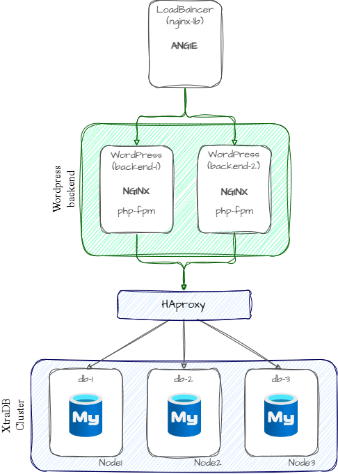
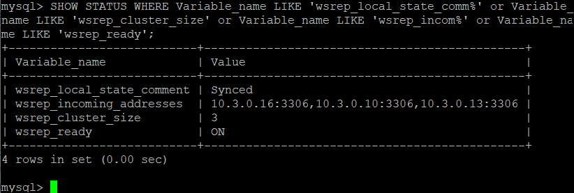

В данном проекте поднимается кластер БД MySQL на основе Percona XtraDB Cluster и клиент - веб-приложение WordPress.
# Задача

# Реализация
## Подготовка terraform (Yandex cloud)
*предполагается, что установка провайдеров и настройка утилиты `yc` уже проведена аналогично описанному в [prereq](../lab1/readme.md)*
Экспортируйте переменные окружения с требуемыми данными YCloud для Terraform:
```
export TF_VAR_TOKEN=$(yc iam create-token)
export TF_VAR_CLOUD_ID=$(yc config get cloud-id)
export TF_VAR_FOLDER_ID=$(yc config get folder-id)
```
## Развертывание и проверка работоспособности
*При необходимости требуется подправить путь до используемого SSH-ключа, прописанный в переменной `ssh_key` в файле `terraform.tfvars`*

Terraform разворачивает следующие ресурсы
- 3 ВМ для кластера БД Percona XtraDB Cluster (`db-1`, `db-2`, `db-3`)
- 1 ВМ с HAProxy в качестве балансировщика подключений к кластеру БД (`nginx-lb-1`, `nginx-lb-2`)
- 1 ВМ с ANGIE в качестве reverse-proxy (`nginx-lb-1`, `nginx-lb-2`)
- 2 ВМ для бэкенда Wordpress (`backend-1`, `backend-2`)



Для развертывания стенда находясь внутри текущей директории выполним 
```
terraform apply
```
После развертывания, зайдем на один из узлов кластера и проверим состояние синхронизации



После воспользуемся выведенным в terraform outputs *site_address* и проверим, что страничка установки WordPress нормально отдается, а значит WordPress успешно установил соединение с БД. 
